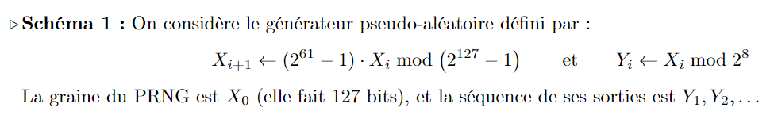
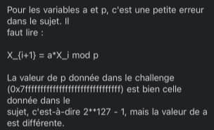

# Projet de CRYPTA

Schéma :

Objectifs :
+ Implanter le schéma
+ Discuter de son efficacité
+ Casser le challenge
+ Trouver une attaque / une manière de l'empêcher
+ Si aucune attaque est trouvée, expliquer les tentatives
+ Comment la sécurité serait-elle affectée si certains paramètres étaient agrandis/rétrécis ?
+ Rapport

Date de rendu : 24/11

## To-do list
+ Faire le rapport "propre"
+ Bien décrire comment marche l'attaque

## Edit : 13/11 - Le sujet change un peu

Il faut donc implanter une version générale du PRNG - ce qui n'est pas un problème. On garde quand même le travail déjà fait, puisqu'on ne va pas jeter ça.

